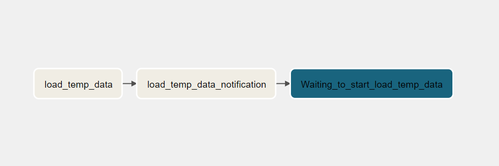

# Data Pipeline with Apache Airflow

## Description

This project is an example of how to create an ETL data pipeline orchestrated with Apache Airflow using some tool such External Task Sensors, File Sensors, etc.

## Process
* **DAG 1**.- This DAG simulates loading data from a source databaes into the temp_data folder, creating a exact temporal copy of the data.

* **DAG 2**.- This DAG have 4 file sensors:  
    * **_Waiting db file_**: This sensor is waiting for temp file into the temp_data folder, once that file arrives, it triggers DAG 3.  
    * **_Waiting raw file_**: This sensor is waiting for raw data file into the raw folder, once that file arrives, it triggers DAG 4.  
    * **_Waiting clean file_**: This sensor is waiting for clean data file into the clean folder, once that file arrives, it triggers DAG 5.  
    * **_Waiting consumption file_**: This sensor is waiting for consumption data file into the consumption folder, once that file arrives, it triggers DAG 6.

* **DAG 3**.- This DAG executes the integration process and load the data from temp_data folder into raw folder.

* **DAG 4**.- This DAG executes the clean process and clean the raw data and save it into clean folder.

* **DAG 5**.- This DAG executes the consumption process and proccess that data applying bussiness rules for specifics reasons and save it into consumption folder.

* **DAG 6**.- This DAG deletes the data in temp_data, because it is a temporary stage and it is not necessary store data there, and it finalizes the process.

## Requirements and Installation

Directories and project strcuture:

    ETL_with_airflow/
            |---airflow/
                    |---dags/
                            |---001_extract_from_db.py
                            |---01_file_sensors.py
                            |---02_raw_process.py
                            |---03_clean_process.py
                            |---04_consumption_process.py
                            |---05_delete_temp_data.py
                    |---logs/
                    |---plugins/
            |---data_source/
                    |---data_sales.csv
            |---etl_process/
                    |---data_integration/
                            |---integration.py
                    |---clean_process/
                            |---extract.py
                            |---load_to_clean_stage.py
                            |---transformations_to_clean.py
                    |---consumption_process/
                            |---extract.py
                            |---load_to_consumption_stage.py
                            |---transformations_to_consumption.py
            |---my_bucket/
                    |---data/
                            |---raw/
                            |---clean/
                            |---consumption/
            |---temp_data/
            |---.gitignore
            |---docker-compose.yaml
            |---README.md
            |---newspaper.db
            |---requirements.txt

It requires Python 3.6 or higher, check your Python version first.  

Run the follow bash command to create a virtual environment:
````bash
python -m venv venv
```` 
To activate the virtual environment run:
````bash
venv/Scripts/activate
````

The [requirements.txt](requirements.txt) should list and install all the required Python libraries that the pipeline depend on.

```bash
pip install -r requirements.txt
```

## Run Airflow
Navigate to the folder where the docker-compose.yaml is located and run:
````bash
docker-compose up
````

## Development
### Data Architecture


### DAG´s Workflow


### Task Workflow
#### DAG 1: 001_extract_from_db.py


#### DAG 2: 01_file_sensors.py


#### DAG 3: 02_raw_process.py


#### DAG 4: 03_clean_process.py


#### DAG 5: 04_consumption_process.py


#### DAG 6: 05_delete_temp_data.py

